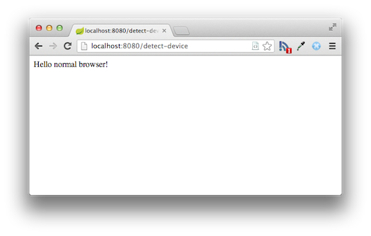
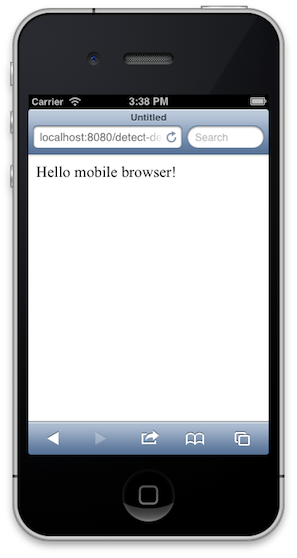
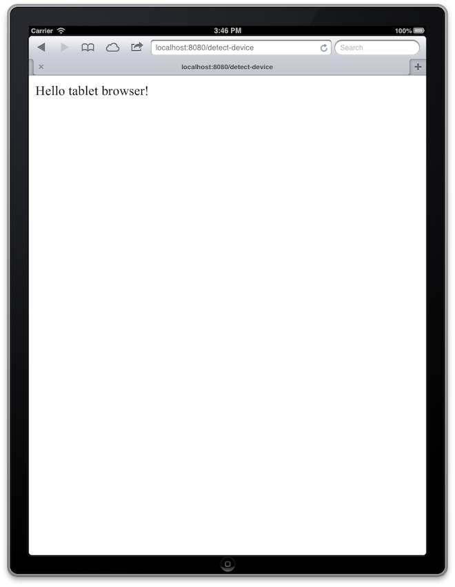

:spring_version: current
:spring_boot_version: 1.1.3.RELEASE
:Component: http://docs.spring.io/spring/docs/{spring_version}/javadoc-api/org/springframework/stereotype/Component.html
:DeviceHandlerMethodArgumentResolver: http://docs.spring.io/spring-mobile/docs/1.1.x/api/org/springframework/mobile/device/DeviceHandlerMethodArgumentResolver.html
:Configuration: http://docs.spring.io/spring/docs/{spring_version}/javadoc-api/org/springframework/context/annotation/Configuration.html
:SpringApplication: http://docs.spring.io/spring-boot/docs/{spring_boot_version}/api/org/springframework/boot/SpringApplication.html
:DeviceResolverHandlerInterceptor: http://docs.spring.io/spring-mobile/docs/1.1.x/api/org/springframework/mobile/device/DeviceResolverHandlerInterceptor.html
:Device: http://docs.spring.io/spring-mobile/docs/1.1.x/api/org/springframework/mobile/device/Device.html
:HandlerInterceptor: http://docs.spring.io/spring/docs/{spring_version}/javadoc-api/org/springframework/web/servlet/HandlerInterceptor.html
:DispatcherServlet: http://docs.spring.io/spring/docs/{spring_version}/javadoc-api/org/springframework/web/servlet/DispatcherServlet.html
:WebMvcConfigurerAdapter: http://docs.spring.io/spring/docs/{spring_version}/javadoc-api/org/springframework/web/servlet/config/annotation/WebMvcConfigurerAdapter.html
:ResponseBody: http://docs.spring.io/spring/docs/{spring_version}/javadoc-api/org/springframework/web/bind/annotation/ResponseBody.html
:EnableAutoConfiguration: http://docs.spring.io/spring-boot/docs/{spring_boot_version}/api/org/springframework/boot/autoconfigure/EnableAutoConfiguration.html
:toc:
:icons: font
:source-highlighter: prettify
:project_id: gs-device-detection
This guide walks you through the process of using Spring to detect the type of device that is accessing your web site.

== What you'll build

You'll create a Spring MVC application that detects the type of device that is accessing your web site and that switches views dynamically based on that device type.

== What you'll need

include::https://raw.githubusercontent.com/spring-guides/getting-started-macros/master/prereq_editor_jdk_buildtools.adoc[]

include::https://raw.githubusercontent.com/spring-guides/getting-started-macros/master/how_to_complete_this_guide.adoc[]

[[scratch]]
== Set up the project

include::https://raw.githubusercontent.com/spring-guides/getting-started-macros/master/build_system_intro.adoc[]

include::https://raw.githubusercontent.com/spring-guides/getting-started-macros/master/create_directory_structure_hello.adoc[]

include::https://raw.githubusercontent.com/spring-guides/getting-started-macros/master/create_both_builds.adoc[]

`build.gradle`
// AsciiDoc source formatting doesn't support groovy, so using java instead
[source,java]
----
include::initial/build.gradle[]
----

include::https://raw.githubusercontent.com/spring-guides/getting-started-macros/master/spring-boot-gradle-plugin.adoc[]

[[initial]]
== Auto-configuration

By including the Spring Mobile dependency, Spring Boot configures a {DeviceResolverHandlerInterceptor}[`DeviceResolverHandlerInterceptor`] and {DeviceHandlerMethodArgumentResolver}[`DeviceHandlerMethodArgumentResolver`] automatically. {DeviceResolverHandlerInterceptor}[`DeviceResolverHandlerInterceptor`] examines the `User-Agent` header in the incoming request, and based on the header value, determines whether the request is coming from a normal (desktop) browser, a mobile (phone) browser, or a tablet browser. The {DeviceHandlerMethodArgumentResolver}[`DeviceHandlerMethodArgumentResolver`] allows Spring MVC to use the resolved {Device}[`Device`] object in a controller method.

== Create a web controller

In Spring, web endpoints are simply Spring MVC controllers. The following Spring MVC controller handles a GET request and returns a String indicating the type of the device:

`src/main/java/hello/DeviceDetectionController.java`
[source,java]
----
include::complete/src/main/java/hello/DeviceDetectionController.java[]
----

For this example, rather than rely on a view (such as JSP) to render model data in HTML, this controller simply returns the data to be written directly to the body of the response. In this case, the data is a String that reads "Hello mobile browser!" if the requesting client is a mobile device. The {ResponseBody}[`@ResponseBody`] annotation tells Spring MVC to write the returned object into the response body, rather than to render a model into a view.

== Make the application executable

Although it is possible to package this service as a traditional link:/understanding/WAR[WAR] file for deployment to an external application server, the simpler approach demonstrated in the next section creates a _standalone application_. You package everything in a single, executable JAR file, driven by a good old Java `main()` method. And along the way, you use Spring's support for embedding the link:/understanding/Tomcat[Tomcat] servlet container as the HTTP runtime, instead of deploying to an external instance.

`src/main/java/hello/Application.java`
[source,java]
----
include::complete/src/main/java/hello/Application.java[]
----

The `main()` method defers to the {SpringApplication}[`SpringApplication`] helper class, providing `Application.class` as an argument to its `run()` method. This tells Spring to read the annotation metadata from `Application` and to manage it as a component in the _link:/understanding/application-context[Spring application context]_.

The `@ComponentScan` annotation tells Spring to search recursively through the `hello` package and its children for classes marked directly or indirectly with Spring's {Component}[`@Component`] annotation. This directive ensures that Spring finds and registers the `DeviceDetectionConfiguration` and `DeviceDetectionController` classes, because they are marked with `@Controller`, which in turn is a kind of `@Component` annotation.

The {EnableAutoConfiguration}[`@EnableAutoConfiguration`] annotation switches on reasonable default behaviors based on the content of your classpath. For example, because the application depends on the embeddable version of Tomcat (tomcat-embed-core.jar), a Tomcat server is set up and configured with reasonable defaults on your behalf. And because the application also depends on Spring MVC (spring-webmvc.jar), a Spring MVC {DispatcherServlet}[`DispatcherServlet`] is configured and registered for you — no `web.xml` necessary! Auto-configuration is a powerful, flexible mechanism. See the {EnableAutoConfiguration}[API documentation] for further details.

include::https://raw.githubusercontent.com/spring-guides/getting-started-macros/master/build_an_executable_jar_subhead.adoc[]

include::https://raw.githubusercontent.com/spring-guides/getting-started-macros/master/build_an_executable_jar_with_both.adoc[]

:module: service
include::https://raw.githubusercontent.com/spring-guides/getting-started-macros/master/run_the_application_with_both.adoc[]

Logging output is displayed. The service should be up and running within a few seconds.

== Test the service

To test the application, point your browser at http://localhost:8080/detect-device. In a normal desktop browser, you should see something like this:

If you point a mobile browser at the same URL (such as the iOS Simulator's browser), you should see something like this (you may have to zoom in on the mobile browser to read the message clearly):

If you point a tablet browser at the URL, you should see something like this:

Note that if you want to use a real mobile device to test this controller, it will not work with the localhost server. You'll need to find the name of your machine on your network and use that instead of localhost.

== Summary

Congratulations! You have just developed a simple web page that detects the type of device being used by a client.
