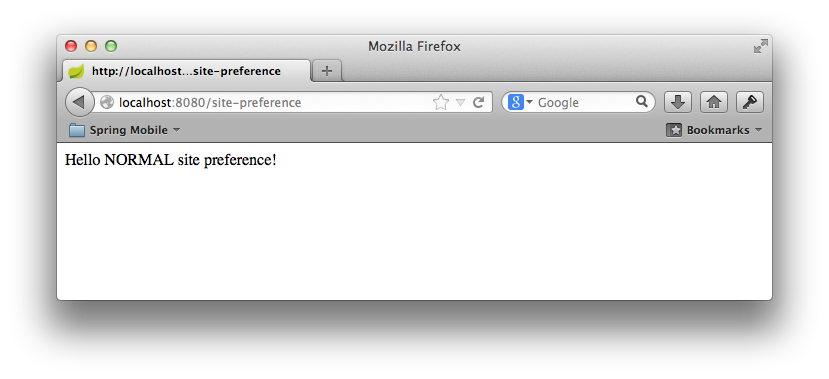

:spring_boot_version: 1.1.4.RELEASE
:SitePreferenceHandlerInterceptor: http://docs.spring.io/spring-mobile/docs/1.1.x/api/org/springframework/mobile/device/site/SitePreferenceHandlerInterceptor.html
:ComponentScan: http://docs.spring.io/spring/docs/current/javadoc-api/org/springframework/context/annotation/ComponentScan.html
:EnableAutoConfiguration: http://docs.spring.io/spring-boot/docs/{spring_boot_version}/api/org/springframework/boot/autoconfigure/EnableAutoConfiguration.html
:DeviceResolverHandlerInterceptor: http://docs.spring.io/spring-mobile/docs/1.1.x/api/org/springframework/mobile/device/DeviceResolverHandlerInterceptor.html
:SpringApplication: http://docs.spring.io/spring-boot/docs/{spring_boot_version}/api/org/springframework/boot/SpringApplication.html
:DispatcherServlet: http://docs.spring.io/spring/docs/current/javadoc-api/org/springframework/web/servlet/DispatcherServlet.html
:Configuration: http://docs.spring.io/spring/docs/3.2.x/javadoc-api/org/springframework/context/annotation/Configuration.html
:HandlerInterceptor: http://docs.spring.io/spring/docs/3.2.x/javadoc-api/org/springframework/web/servlet/HandlerInterceptor.html
:Device: http://docs.spring.io/spring-mobile/docs/1.1.x/api/org/springframework/mobile/device/Device.html
:WebMvcConfigurerAdapter: http://docs.spring.io/spring/docs/3.2.x/javadoc-api/org/springframework/web/servlet/config/annotation/WebMvcConfigurerAdapter.html
:Component: http://docs.spring.io/spring/docs/current/javadoc-api/org/springframework/stereotype/Component.html
:ResponseBody: http://docs.spring.io/spring/docs/3.2.x/javadoc-api/org/springframework/web/bind/annotation/ResponseBody.html
:SitePreferenceMethodArgumentResolver: http://docs.spring.io/spring-mobile/docs/1.1.x/api/org/springframework/mobile/device/site/SitePreferenceHandlerMethodArgumentResolver.html
:toc:
:icons: font
:source-highlighter: prettify
:project_id: gs-handling-site-preference

This guide walks you through the process of using Spring to provide a user with the choice of viewing a normal, mobile, or tablet version of your site, regardless of what type of device being used.

== What you'll build

You will create a Spring Web MVC application that detects the type of device that is accessing your web site and enables functionality to override the default view for the device by selecting an alternate site preference.

== What you'll need

include::https://raw.githubusercontent.com/spring-guides/getting-started-macros/master/prereq_editor_jdk_buildtools.adoc[]

:jump_ahead: Create a configuration class
include::https://raw.githubusercontent.com/spring-guides/getting-started-macros/master/how_to_complete_this_guide.adoc[]

[[scratch]]
== Set up the project

include::https://raw.githubusercontent.com/spring-guides/getting-started-macros/master/build_system_intro.adoc[]

include::https://raw.githubusercontent.com/spring-guides/getting-started-macros/master/create_directory_structure_hello.adoc[]

include::https://raw.githubusercontent.com/spring-guides/getting-started-macros/master/create_both_builds.adoc[]

`build.gradle`
// AsciiDoc source formatting doesn't support groovy, so using java instead
[source,java]
----
include::initial/build.gradle[]
----

include::https://raw.githubusercontent.com/spring-guides/getting-started-macros/master/bootstrap_starter_pom_disclaimer.adoc[]

[[initial]]
== Auto-configuration

Spring Boot auto-configures three classes, {DeviceResolverHandlerInterceptor}[`DeviceResolverHandlerInterceptor`], {SitePreferenceHandlerInterceptor}[`SitePreferenceHandlerInterceptor`] and {SitePreferenceMethodArgumentResolver}[`SitePreferenceMethodArgumentResolver`]. {DeviceResolverHandlerInterceptor}[`DeviceResolverHandlerInterceptor`] is an implementation of a {HandlerInterceptor}[`HandlerInterceptor`] which, as the name implies, intercepts a request to the application and determines the type of requesting device. After the device is resolved, the {SitePreferenceMethodArgumentResolver}[`SitePreferenceMethodArgumentResolver`] allows Spring MVC to use the resolved `SitePreference` object in a controller method.

Internally, {DeviceResolverHandlerInterceptor}[`DeviceResolverHandlerInterceptor`] examines the `User-Agent` header in the incoming request, and based on the header value, determines whether the request is coming from a normal (desktop) browser, a mobile (phone) browser, or a tablet browser. {DeviceResolverHandlerInterceptor}[`DeviceResolverHandlerInterceptor`] offers several entry points for overriding or customizing how a device is resolved.

{SitePreferenceHandlerInterceptor}[`SitePreferenceHandlerInterceptor`] utilizes the detected device to determine a user's initial site preference. If the user prefers a different site, then that site preference and be used in subsequent requests to override the resolved device value. The site preference is set by passing a specific query string parameter in a request. Once received, the preference is persisted in a cookie for future reference.

Site preference functionality is enabled by default in Spring Boot when you include the Spring Mobile starter. However, it can be disabled by setting the following property to `false`:

`src/main/resources/application.properties`
[source,java]
----
include::complete/src/main/resources/application.properties[]
----

== Create a web controller

In Spring, web endpoints are simply Spring MVC controllers. The following Spring MVC controller handles a GET request and returns a String indicating the type of the device:

`src/main/java/hello/GreetingController.java`
[source,java]
----
include::complete/src/main/java/hello/GreetingController.java[]
----

For this example, rather than rely on a view (such as JSP) to render model data in HTML, this controller simply returns the data to be written directly to the body of the response. In this case, the data is a String that reads "Hello NORMAL site preference!" if the requesting client is a desktop browser. The {ResponseBody}[`@ResponseBody`] annotation tells Spring MVC to write the returned object into the response body, rather than to render a model into a view.

== Make the application executable

Although it is possible to package this service as a traditional link:/understanding/WAR[WAR] file for deployment to an external application server, the simpler approach demonstrated in the next section creates a _standalone application_. You package everything in a single, executable JAR file, driven by a good old Java `main()` method. And along the way, you use Spring's support for embedding the link:/understanding/Tomcat[Tomcat] servlet container as the HTTP runtime, instead of deploying to an external instance.

`src/main/java/hello/Application.java`
[source,java]
----
include::complete/src/main/java/hello/Application.java[]
----

The `main()` method defers to the {SpringApplication}[`SpringApplication`] helper class, providing `Application.class` as an argument to its `run()` method. This tells Spring to read the annotation metadata from `Application` and to manage it as a component in the _link:/understanding/application-context[Spring application context]_.

The {`@ComponentScan`} annotation tells Spring to search recursively through the `hello` package and its children for classes marked directly or indirectly with Spring's {`@Component`} annotation. This directive ensures that Spring finds and registers the `SitePreferenceConfiguration` and `SitePreferenceController` classes, because they are marked with [`@Controller`], which in turn is a kind of {`@Component`} annotation.

The {`@EnableAutoConfiguration`} annotation switches on reasonable default behaviors based on the content of your classpath. For example, because the application depends on the embeddable version of Tomcat (tomcat-embed-core.jar), a Tomcat server is set up and configured with reasonable defaults on your behalf. And because the application also depends on Spring MVC (spring-webmvc.jar), a Spring MVC {`DispatcherServlet`} is configured and registered for you — no `web.xml` necessary! Auto-configuration is a powerful, flexible mechanism. See the {`@EnableAutoConfiguration`}[API documentation] for further details.

include::https://raw.githubusercontent.com/spring-guides/getting-started-macros/master/build_an_executable_jar_subhead.adoc[]

include::https://raw.githubusercontent.com/spring-guides/getting-started-macros/master/build_an_executable_jar_with_both.adoc[]

:module: service
include::https://raw.githubusercontent.com/spring-guides/getting-started-macros/master/run_the_application_with_both.adoc[]

Logging output is displayed. The service should be up and running within a few seconds.

== Test the service

To test the application, open the following link in a browser. In a normal desktop browser, you should see something like this:

http://localhost:8080/site-preference

By passing the `site_preference=mobile` querystring parameter, a user can specify a preference for the mobile site. For example, your site may expose a link from the home page. The link below includes the parameter to change your site preference.

http://localhost:8080/site-preference?site_preference=mobile

image::images/set-mobile-preference.png[The response for a mobile browser]

The site preference is now stored in a cookie and subsequent requests to the site will respect the new preference, without the need of a querystring parameter.

http://localhost:8080/site-preference

image::images/respect-mobile-preference.png[The response for a tablet browser]

== Summary

Congratulations! You have just developed a simple web page that detects the type of device being used by a client and offers the option to prefer a different version of the site.

